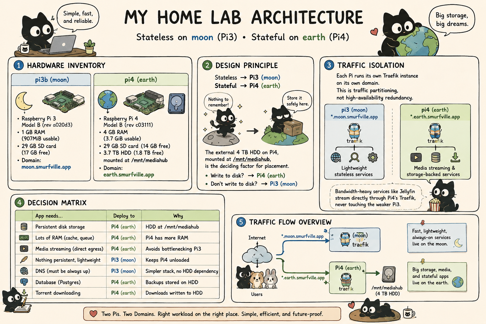

# Home Lab Architecture



## Hardware Inventory

| Host | Model | RAM | Storage | Domain |
|------|-------|-----|---------|--------|
| pi3b | Raspberry Pi 3 Model B (rev a020d3) | 1 GB (907MiB usable) | 29 GB SD card (17 GB free) | `moon.smurfville.app` |
| pi4 | Raspberry Pi 4 Model B (rev c03111) | 4 GB (3.7 GiB usable) | 29 GB SD (14 GB free) + 3.7 TB HDD (1.8 TB free) at `/mnt/mediahub` | `earth.smurfville.app` |

## Design Principle

**Stateless → Pi3 (`moon`), Stateful → Pi4 (`earth`)**

The external 4 TB HDD on Pi4, mounted at `/mnt/mediahub`, is the deciding factor for placement:
- Services that write to disk (media libraries, databases, file uploads) → **Pi4**
- Services that don't (reverse proxy, DNS, indexers) → **Pi3**

## Traffic Isolation

Each Pi runs its own Traefik instance on a separate domain. This is **traffic partitioning**, not high-availability redundancy.

| Host | Domain | Handles |
|------|--------|---------|
| Pi3 | `*.moon.smurfville.app` | Lightweight stateless services |
| Pi4 | `*.earth.smurfville.app` | Media streaming, storage-backed services |

Bandwidth-heavy services like Jellyfin stream directly through Pi4's Traefik, never touching the weaker Pi3.

## Decision Matrix

| App needs... | Deploy to | Why |
|---|---|---|
| Persistent disk storage | Pi4 | HDD at `/mnt/mediahub` |
| Lots of RAM (cache, queue) | Pi4 | Pi4 has more RAM |
| Media streaming (direct egress) | Pi4 | Avoids bottlenecking Pi3 |
| Nothing persistent, lightweight | Pi3 | Keeps Pi4 unloaded |
| DNS (must be always up) | Pi3 | Simpler stack, no HDD dependency |
| Database (Postgres) | Pi4 | Backups stored on HDD |
| Torrent downloading | Pi4 | Downloads written to HDD |

## Current Role Placement

### Pi3 (`moon`) — Stateless / Lightweight

| Role | Why here |
|---|---|---|
| `pihole` | DNS-critical, no storage needed |
| `prowlarr` | Indexer, no media storage |
| `traefik` | Moon domain ingress |
| `glances` | Monitoring |
| `base-requirements` + `docker` | Infrastructure |
| `hawser` | Dockhand agent for remote Docker management |

### Pi4 (`earth`) — Stateful / Storage-Heavy

| Role | Why here |
|---|---|
| `mount-hdd` | External HDD physically attached to Pi4 |
| `postgres` | Database backups stored on HDD |
| `valkey` | In-memory cache (needs RAM, no persistence) |
| `sonarr` / `radarr` | Media library on HDD |
| `bazarr` | Subtitle downloader for Sonarr/Radarr |
| `transmission` | Torrent downloads to HDD |
| `jellyfin` | Media streaming + HDD library |
| `sure-finance` | File uploads + Postgres dependency |
| `traefik` | Earth domain ingress (direct traffic) |
| `glances` | Monitoring |
| `dockhand` | Docker management UI (controller) |

## Config Loss Tolerance

- **Pi3 services** (pihole, prowlarr): Config is not backed up. Rebuild from scratch if the SD card dies.
- **Pi4 services** (postgres): Database backups written to HDD daily at 00:30 via cron.
- **HDD failure**: Single point of failure for all media and app data. No RAID or replication.

## How to Check Host Specs

SSH into each Pi and run:

```shell
# CPU info
lscpu | grep "Model name"
cat /proc/cpuinfo | grep "Model"

# RAM
free -h

# Storage
df -h
lsblk

# ARM version
cat /proc/cpuinfo | grep "CPU architecture"
```
